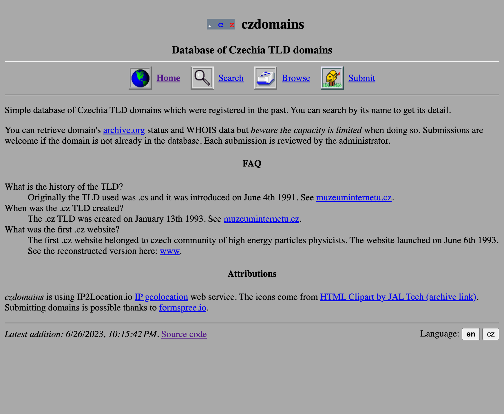

# czdomains



Database of registered `.cz` (Czechia) TLD domains. Contains frontend which can
be queried. Each entry can look up an archived content on archive.org and look-up its WHOIS data.

An instance running at [czdomains.synacek.xyz](https://czdomains.synacek.xyz).

## Prerequisites

Application requires NodeJS environment and access to file system due to data being stored in sqlite file.

Lookup service for WHOIS data is IP2Location.io and you will need API key to use it. Form for submitting new domains uses formspree.io service.
Any of these two should be easily replacable with an alternative.

## Populating database with data

You can run import script:

`npm run import -- --file [path-to-file]`

The file should include one domain per line. This script will ingest the domains and ignore any duplicates. This data is not part of this repository.

If you are running the application via docker, provide additional flag `--dbFilePath=./data/sqlite.db`, assuming you are running it in specified `WORKDIR`.

## Development

### JSON schema

Endpoints use JSON schema to define the constraints of inputs. Run `npm run schema:compile` to convert JSON schema to Typescript definitions.

### Lint & typecheck

- `npm run lint` lints the codebase.
- `npm run typecheck` runs Typescript compiler without emitting source to check for any errors

### Formatter

`npm run format`

### Test

`npm run test`

### Development server

- `npm run dev` will launch application in development mode
- `npm run dev:debug` attaches debugger

## Deployment

### Docker (recommended)

Make sure you have all your secrets define in `.env`, see `.env.example` to see what these are. The values for `HOST`, `PORT` and `DB_PATH` will be overwritten when the image is built.

If you have existing database, place it in this location: `./data/sqlite.db` (the name must stay the same), otherwise database will be created at that location.

Build the image:

```bash
$ docker build -t czdomains .
```

Run the container (recommended settings for server environment):

```bash
$ docker run -d --name czdomains -p 3000:3000 --restart always -v $(pwd)/data:/app/data czdomains
```

This will run the application in daemon mode (in the background) and make sure it is automatically restarted.
The volume `-v` flag is important so the database can be found at the right place and data is persisted.
You can customize the host port with `-p` flag if you need to, e.g. if you want to have it accessible on port 80, change it to `-p 80:3000`.

The application will automatically run all the migrations when it starts. If you need to import data, follow the instructions in the `Populating database with data` section.

### Bare metal

Make sure you have all your secrets define in `.env`, copy `.env.example` to see what these are.

Application can be started with `npm run start`. You should provide `PORT` environment variable to specify which port to run the webserver on. You can add this variable to `.env` file as well.

Before you run the application for the first time, run migration script `npm run migrate` that will set up database tables.
